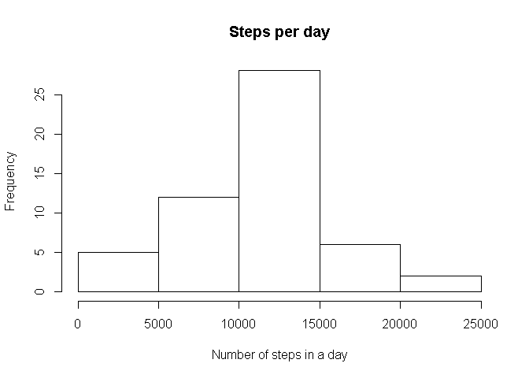

Reproducible Research - Peer Assessment 1
=========================================

## Load and Pre-process data


- Download as zip
- unzip to csv
- Preprosses the data


```r
zip_url <- "http://d396qusza40orc.cloudfront.net/repdata%2Fdata%2Factivity.zip"
temp <- tempfile()
download.file(zip_url, temp, mode="wb")
unzip(temp,"activity.csv")
data <- read.table("activity.csv", sep=",", header=TRUE)
unlink(temp)

library(dplyr)
data_by_date <- group_by(data, date)
```

## Steps in a day

1. Calculate the total number of steps in a day
2. Plot a histogram of total number of steps in a day
3. Calculate mean and median of total number of steps in a day


```r
steps_by_date <- summarise(data_by_date, steps=sum(steps))

hist(steps_by_date$steps)
```

 

```r
final_steps_by_date <- summarise(steps_by_date,
                                 avg_steps=mean(steps,na.rm=TRUE),
                                 med_steps=median(steps,na.rm=TRUE))

avgstp <- final_steps_by_date[1,1]
medstp <- final_steps_by_date[1,2]
```
The average number of steps in a day is 1.0766189 &times; 10<sup>4</sup>  
The median number of steps in a day is 10765
